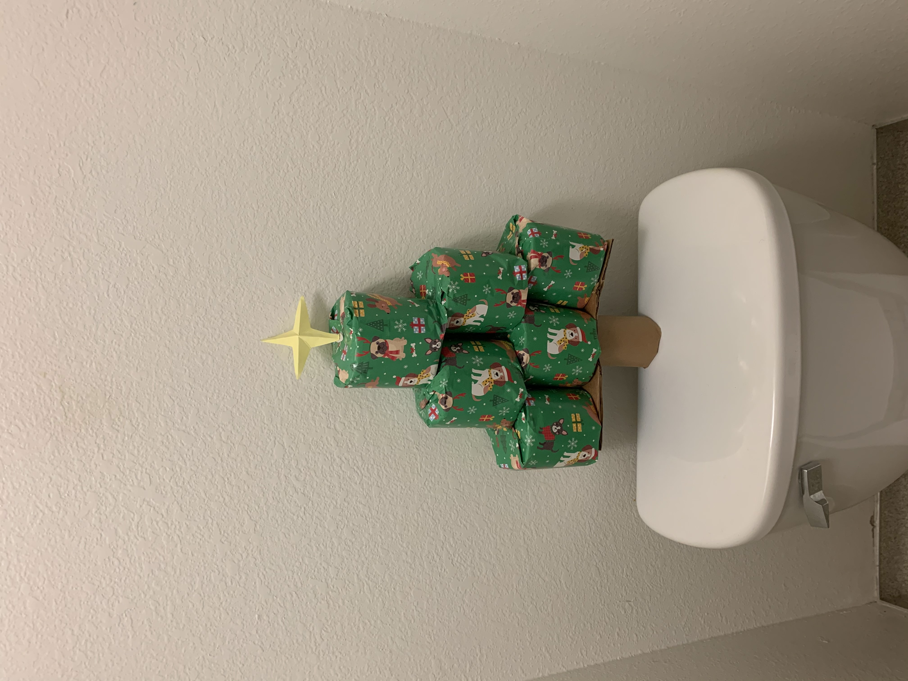

# Eric Peng's Main Page 
Hi there, my name is ***Eric Peng***  
Currently a student at **UCSD** *Jacobs School of Engineering* Studying in the major of *Computer Science*  
I am a 4th year student, but also a 2nd year transfer to this school  
I was born and rasied in Taiwan, and moved to the United States at the age of 18, if you want to know more of me you can go [here](background.md) and read the full story  
So far i have not taken a lot of CSE classes, but I have a rough idea of what i want to do in the future, personally i am a big fan of front end, i like making beautiful website and making useful tools that people appreicats, so i think front end engineering will be the thing i want to do most.   
 

# Things I Like To Do: 
- Cooking foods 
- Baking cakes 
- Drinking *(but not too much)*
- Find fun things to do in my life, here is an example of me wrapping our **TP rolls** into a chrismas tree during Christmas! 
   

# Ranking My Favorite Programming Languages
1. Haskell 
    - Haskell is just one of those elegant programming language that one need to appreciate 
      - Here is an example of how power set is down in Haskell, ain't it beautiful? `powerSet = filterM (const [True, False])`

2. Python 
   - Becasuse of the powerful library supports
3. Julia 
   - Mainly because of the powerful number crunching ability 
4. C Language 
   - well who doesn't appreaciate some old school beautiful c code 

# My Bucket List 
- [x] Go to all 30 MLB statidums 
- [x] Travel to NYC 
- [ ] Road trip to every state 
- [ ] Travel in Europe 
- [ ] Learn how to surf
- [ ] Learn how to skateboard 

 
# Link: 

> click on the icons for links to my social media 

btw, this class is CSE 110, and this site was built using github pages, if you want to learn more about the classes i am going thru, checkout [UCSD](https://ucsd.edu/)
